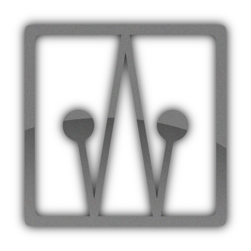
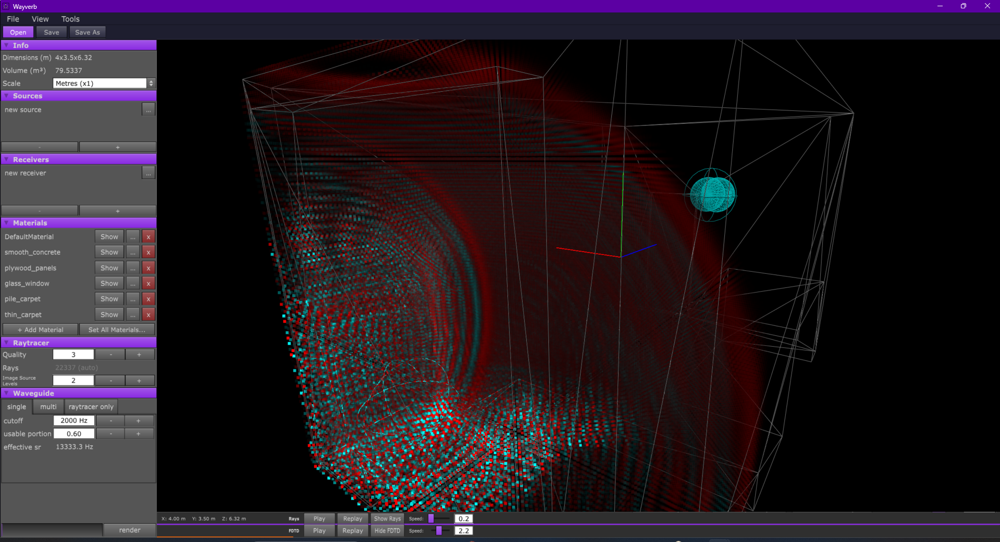
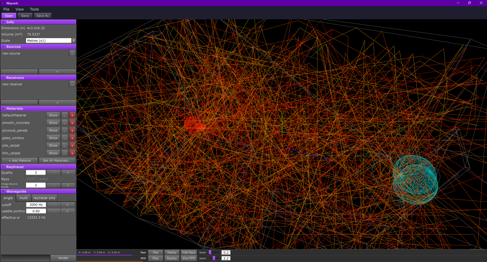
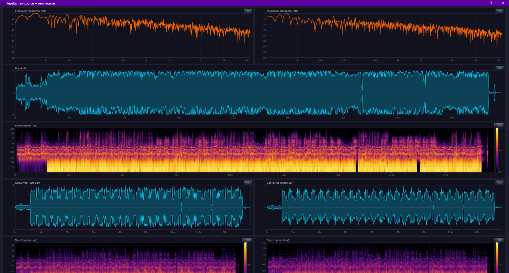
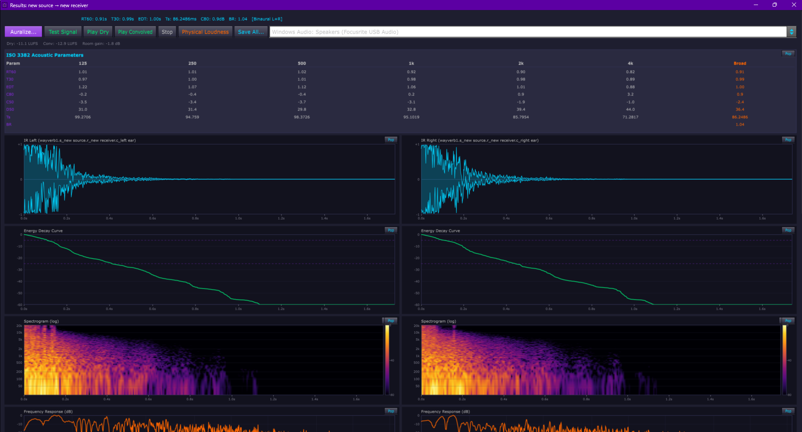
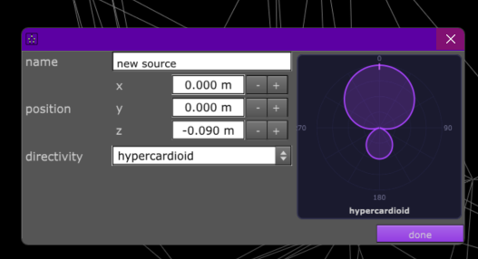
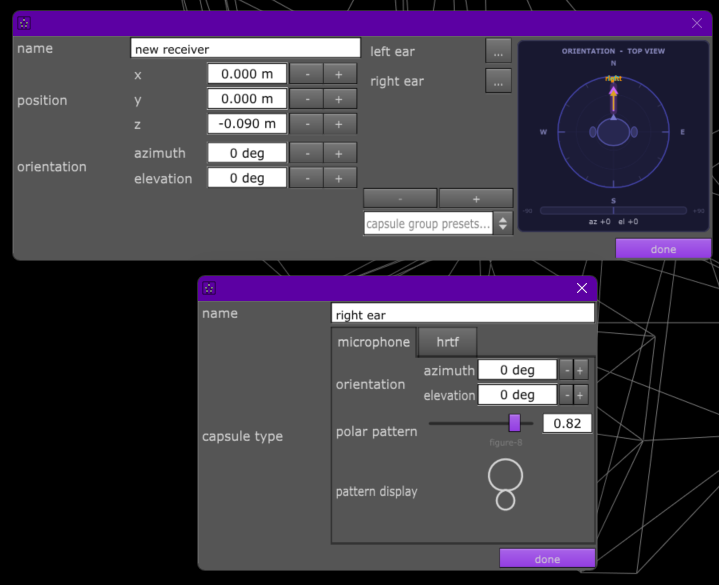
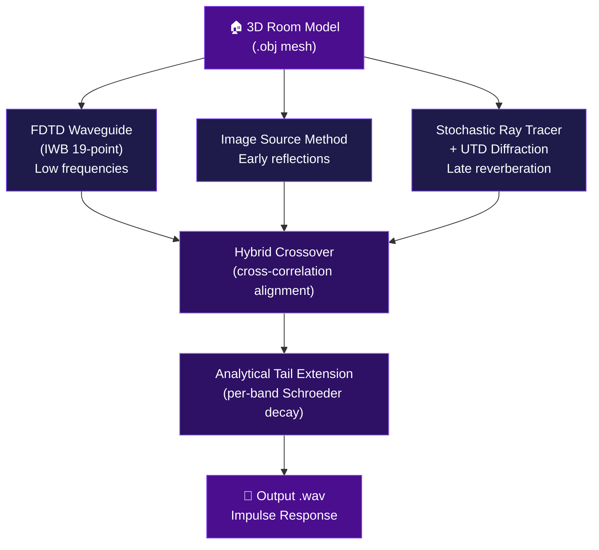

# Wayverb v1.2 — Windows Room Acoustics Simulator

> **Hybrid waveguide + ray-tracing room acoustic simulator with GPU acceleration.**
> Based on [Wayverb by Reuben Thomas](https://github.com/reuk/wayverb) (originally macOS-only). This fork ports it to **Windows 11** and rewrites the physics engine.
>
> **[v1.0](https://github.com/Burhanuddin98/wayverb-windows/tree/v1.0)** — original Windows port | **v1.2** (this branch) — rewritten physics engine

<p align="center">
  
</p>

---

## What's New in v1.2 — Physics Engine Rewrite

Version 1.2 is a complete rewrite of the acoustic simulation core. Seven structural problems in the original engine have been fixed:

| Change | Before (v1.1) | After (v1.2) |
|--------|--------------|--------------|
| **FDTD stencil** | 7-point rectilinear (40% Nyquist, anisotropic) | IWB 19-point (90% Nyquist, isotropic) |
| **Boundary absorption** | 5% minimum floor (glass/marble impossible) | No floor; 0.9999 numerical damping + stability margin |
| **Scattering model** | Mean across all bands (frequency-independent) | Per-band scattering on both specular and diffuse paths |
| **Edge diffraction** | None | First-order UTD (Kouyoumjian-Pathak) |
| **Stochastic tail** | 4.5 dB jitter, linear interpolation | 5.6 dB Rayleigh jitter, cubic Hermite spline |
| **Crossover blend** | Threshold alignment, +/-12 dB correction | Cross-correlation alignment, +/-6 dB, 2x fade |
| **Late reverb tail** | FDN artificial reverb | Analytical Schroeder tail (per-band decay) |

---

## Screenshots

### Waveguide Mesh Simulation
<p align="center">
  
</p>

The IWB 19-point FDTD mesh running inside a room model. Red/cyan dots show pressure values at each grid node. The teal sphere is the receiver. The left panel shows material assignments and simulation parameters.

### Ray Tracing Visualization
<p align="center">
  
</p>

Thousands of rays traced through the room geometry with frequency-dependent scattering. Orange lines show specular and diffuse reflection paths; the receiver sphere (right) collects energy from all directions.

### Impulse Response — Waveforms & Spectrograms
<p align="center">
  
</p>

Post-render results window showing the computed impulse response. Top row: time-domain waveforms (left/right ears for HRTF mode). Middle/bottom rows: spectrograms showing frequency content over time — the late reverb tail now has smooth, physically correct per-band decay.

### Acoustic Parameter Analysis
<p align="center">
  
</p>

ISO 3382 acoustic parameters computed from the rendered IR: T30 reverberation time, EDT, C80, D50, and TS per octave band. Energy decay curves (green) show the Schroeder backward integration. The analytical tail extension ensures the full decay is captured without FDN artifacts.

### Source Directivity Patterns
<p align="center">
  
</p>

Source configuration with selectable 3D directivity patterns: omnidirectional, cardioid, supercardioid, hypercardioid, figure-eight, and hemisphere. The polar plot updates in real-time. Directivity weighting is applied to all image source and diffraction impulses.

### Receiver — HRTF & Microphone Modes
<p align="center">
  
</p>

Receiver configuration with capsule setup. Each capsule can operate in **microphone** mode (omnidirectional with adjustable polar pattern) or **HRTF** mode (binaural head-related transfer function for headphone listening). The orientation display shows the receiver's look direction.

---

## Quick Start — Running the Pre-Built Executable

If you just want to **run** Wayverb without building from source:

1. Download or clone this repo
2. Navigate to `wayverb/wayverb-0.0.1/wayverb-0.0.1/bin/`
3. Double-click **`wayverb.exe`**

The `bin/` folder already contains all required DLLs. You need:
- Windows 10 or 11 (64-bit)
- A GPU with an up-to-date driver (NVIDIA or AMD)

### Your First Render

1. **File > Open** and load a `.obj` room model
   - Example scenes are in `wayverb/wayverb-0.0.1/wayverb-0.0.1/demo/assets/test_models/` — start with **`bedroom.obj`**
2. Place the **source** (speaker icon) and **receiver** (microphone icon) inside the room
3. Click **Render** and wait for the progress bar to complete
4. The output `.wav` impulse response is written to your chosen output folder

### Tips
- Models must be **watertight** (no holes). The FDTD mesh solver needs a defined interior
- Start with small rooms (< 500 m^3, < 2000 triangles) for fast renders
- On a 6GB GPU, renders of `bedroom.obj` complete in 2-5 minutes

---

## Building from Source

### Prerequisites

- Windows 10/11 (64-bit)
- [MSYS2](https://www.msys2.org/) installed to `C:\msys64`
- NVIDIA or AMD GPU with up-to-date drivers

### Step 1 — Install dependencies

Open the **MSYS2 MinGW64** shell and run:

```bash
pacman -Syu
# Close and reopen the shell, then:
pacman -S --needed \
  mingw-w64-x86_64-gcc \
  mingw-w64-x86_64-cmake \
  mingw-w64-x86_64-ninja \
  mingw-w64-x86_64-pkg-config \
  mingw-w64-x86_64-glm \
  mingw-w64-x86_64-glew \
  mingw-w64-x86_64-assimp \
  mingw-w64-x86_64-fftw \
  mingw-w64-x86_64-libsndfile \
  mingw-w64-x86_64-libsamplerate \
  mingw-w64-x86_64-gtest \
  mingw-w64-x86_64-cereal \
  mingw-w64-x86_64-opencl-icd \
  mingw-w64-x86_64-opencl-headers \
  git
```

### Step 2 — Clone and navigate

```bash
git clone https://github.com/Burhanuddin98/wayverb-windows.git
cd wayverb-windows/wayverb/wayverb-0.0.1/wayverb-0.0.1
```

### Step 3 — Build modern_gl_utils

```bash
cd modern_gl_utils
mkdir -p build_win && cd build_win
cmake .. -G Ninja -DCMAKE_BUILD_TYPE=Release -DCMAKE_PREFIX_PATH=C:/msys64/mingw64
ninja
cd ../..
```

### Step 4 — Build the libraries

```bash
mkdir -p build_win && cd build_win
cmake .. -G Ninja -DCMAKE_BUILD_TYPE=Release -DCMAKE_PREFIX_PATH=C:/msys64/mingw64
ninja
cd ..
```

### Step 5 — Build the GUI

```bash
cd wayverb
mkdir -p build_win && cd build_win
cmake .. -G Ninja -DCMAKE_BUILD_TYPE=Release -DCMAKE_PREFIX_PATH=C:/msys64/mingw64
ninja
cd ../..
```

### Step 6 — Copy runtime DLLs and run

```bash
cd bin
cp /c/msys64/mingw64/bin/{libgcc_s_seh-1,libstdc++-6,libwinpthread-1}.dll .
cp /c/msys64/mingw64/bin/{libassimp*,libsndfile*,libsamplerate*,libfftw3f*,libOpenCL,libmpg123*}.dll .
./wayverb.exe
```

---

## Simulation Architecture

Wayverb produces room impulse responses by combining three complementary methods:



### v1.2 Physics Improvements in Detail

**IWB 19-Point Stencil** — The waveguide now uses 6 face-adjacent + 12 edge-diagonal neighbors with optimized weights (Kowalczyk & van Walstijn, 2011). This eliminates direction-dependent phase velocity error, making room modes accurate in all directions up to ~90% of the waveguide Nyquist frequency.

**No Absorption Floor** — The old 5% minimum absorption has been removed. Materials like glass (alpha = 0.02), marble, and polished concrete are now modeled at their true reflectance. A 0.9999 per-step numerical damping and 0.998 stability margin on IIR boundary filter poles prevent divergence without distorting the physics.

**Frequency-Dependent Scattering** — The per-band scattering coefficient from each material is now used to weight specular vs. diffuse energy on every reflection. Low frequencies scatter less (surfaces appear smooth relative to wavelength); high frequencies scatter more.

**UTD Edge Diffraction** — First-order diffraction around edges is computed using the Uniform Theory of Diffraction. The diffraction coefficient D(f) scales as 1/sqrt(f), correctly modeling how low frequencies bend around corners while high frequencies cast sharp shadows.

**Cubic Hermite Spectral Synthesis** — The stochastic reverb tail uses Catmull-Rom cubic Hermite spline interpolation between the 16 histogram bands instead of log-linear, producing smoother spectral contours. Spectral jitter uses the physically correct 5.6 dB standard deviation from Rayleigh amplitude statistics.

**Cross-Correlation Alignment** — The waveguide and raytracer signals are aligned using cross-correlation instead of threshold-based onset detection. This is robust even when the direct sound is weak or occluded.

**Analytical Tail Extension** — The FDN (Feedback Delay Network) artificial reverb has been replaced with an analytical Schroeder tail that measures the signal's own decay rate and extends it with exponentially-decaying noise. Each frequency band decays at its own physically correct rate.

---

## Troubleshooting

| Symptom | Fix |
|---------|-----|
| Black window on launch | Already patched in this repo; update your GPU driver |
| `clBuildProgram` error | Update GPU driver; try a simpler scene |
| Render crashes immediately | Scene too large — start with `bedroom.obj` |
| Missing DLL error | Copy DLLs from Step 6 above |
| `Source is outside mesh` | Move source/receiver inside the room geometry |
| Very slow render | Use a simpler model with fewer triangles |

---

## Project Structure

```
wayverb-windows/
  wayverb/wayverb-0.0.1/wayverb-0.0.1/
    src/
      core/           — Scene, surfaces, serialization, math
      waveguide/      — IWB FDTD waveguide (OpenCL GPU)
      raytracer/      — Ray tracer, ISM, stochastic tail, UTD diffraction
      combined/       — Hybrid engine, crossover, postprocessing
      frequency_domain/ — FFT, multiband filter, convolution
      hrtf/           — HRTF binaural rendering
      audio_file/     — WAV/AIF output
      utilities/      — Containers, iterators, helpers
    wayverb/Source/   — JUCE GUI application
    bin/              — Pre-built executable + DLLs
    demo/             — Example room models and presets
    tools/            — analyze_ir.py, hot_rebuild.sh
    test/             — validate_render.py, quick_check.sh
```

---

## License

Original Wayverb library by Reuben Thomas. See `wayverb/wayverb-0.0.1/wayverb-0.0.1/LICENSE`.

Windows port and v1.2 physics rewrite by Burhanuddin Sakaliwala.

**Software is provided "as is", without warranty of any kind.**
