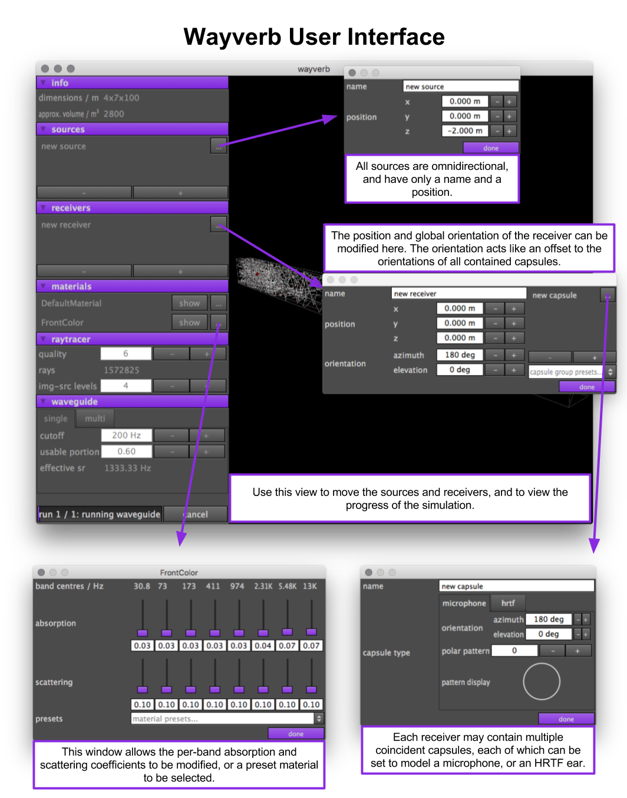

# Wayverb — Windows Port

> **Hybrid waveguide + ray-tracing room acoustic simulator with GPU acceleration.**
> Originally macOS-only. This fork makes it run on **Windows 11** with MSYS2 / MinGW-w64 / NVIDIA OpenCL.



---

## What is Wayverb?

Wayverb simulates how sound behaves inside a 3D room and produces a **room impulse response (IR)** — a `.wav` file you can drop into any convolution reverb to make audio sound like it was recorded in that space. Useful for architects, sound designers, game audio, and music production.

It combines three simulation methods to cover the full frequency range:

| Method | Frequency range | What it models |
|--------|----------------|----------------|
| Image-source (ISM) | High — early reflections | Specular wall bounces |
| Stochastic ray-tracing | High — late reverberation | Diffuse energy decay |
| Rectilinear waveguide mesh (FDTD) | Low | Wave behaviour, diffraction, resonance |

---

## Platform support

| Platform | Status |
|----------|--------|
| Windows 11 — MSYS2 / MinGW-w64 / GCC 15 | Working |
| NVIDIA GPU (OpenCL) | Tested on RTX 2060 |
| AMD GPU | Should work — untested |
| macOS (original upstream) | See original readme section below |

---

## Building on Windows 11

### Prerequisites

- Windows 10 or 11 (64-bit)
- [MSYS2](https://www.msys2.org/) installed to `C:\msys64`
- An NVIDIA or AMD GPU with an up-to-date driver

---

### Step 1 — Install MSYS2

Download and run the installer from **https://www.msys2.org**.

Open the **MSYS2 MinGW64** shell (look for it in the Start menu — make sure it says MinGW64, not MSYS or UCRT64).

---

### Step 2 — Install the toolchain and dependencies

```bash
pacman -Syu
```

Close and reopen the shell, then install everything in one command:

```bash
pacman -S --needed \
  mingw-w64-x86_64-gcc \
  mingw-w64-x86_64-cmake \
  mingw-w64-x86_64-ninja \
  mingw-w64-x86_64-pkg-config \
  mingw-w64-x86_64-glm \
  mingw-w64-x86_64-glew \
  mingw-w64-x86_64-assimp \
  mingw-w64-x86_64-fftw \
  mingw-w64-x86_64-libsndfile \
  mingw-w64-x86_64-libsamplerate \
  mingw-w64-x86_64-gtest \
  mingw-w64-x86_64-cereal \
  mingw-w64-x86_64-opencl-icd \
  mingw-w64-x86_64-opencl-headers \
  git
```

OpenCL uses your existing GPU driver via the ICD loader — no extra driver install needed beyond your normal GPU driver.

---

### Step 3 — Clone the repo

```bash
git clone https://github.com/Burhanuddin98/wayverb-windows.git
cd wayverb-windows/wayverb/wayverb-0.0.1/wayverb-0.0.1
```

---

### Step 4 — Build modern_gl_utils

The GUI depends on a small OpenGL utility library that must be compiled first.

```bash
cd modern_gl_utils
mkdir -p build_win && cd build_win
cmake .. -G Ninja \
  -DCMAKE_BUILD_TYPE=Release \
  -DCMAKE_PREFIX_PATH=C:/msys64/mingw64
ninja
cd ../..
```

---

### Step 5 — Build the Wayverb libraries

```bash
mkdir -p build_win && cd build_win
cmake .. -G Ninja \
  -DCMAKE_BUILD_TYPE=Release \
  -DCMAKE_PREFIX_PATH=C:/msys64/mingw64
ninja
cd ..
```

This produces all static libraries in `build_win/lib/`.

---

### Step 6 — Build the GUI application

```bash
cd wayverb
mkdir -p build_mgu && cd build_mgu
cmake .. -G Ninja \
  -DCMAKE_BUILD_TYPE=Release \
  -DCMAKE_PREFIX_PATH=C:/msys64/mingw64
ninja
cd ../..
```

The final executable is at:

```
bin/wayverb.exe
```

---

### Step 7 — Copy runtime DLLs

The exe needs the MinGW runtime DLLs alongside it. From the `bin/` folder:

```bash
cd bin
cp /c/msys64/mingw64/bin/libgcc_s_seh-1.dll .
cp /c/msys64/mingw64/bin/libstdc++-6.dll .
cp /c/msys64/mingw64/bin/libwinpthread-1.dll .
cp /c/msys64/mingw64/bin/libassimp*.dll .
cp /c/msys64/mingw64/bin/libsndfile*.dll .
cp /c/msys64/mingw64/bin/libsamplerate*.dll .
cp /c/msys64/mingw64/bin/libfftw3f*.dll .
cp /c/msys64/mingw64/bin/libOpenCL.dll .
cp /c/msys64/mingw64/bin/libmpg123*.dll .
```

---

### Step 8 — Run

```bash
./bin/wayverb.exe
```

Or just double-click `wayverb.exe` from Explorer.

---

## Using Wayverb

1. **File → Open** to load a `.obj` 3D room model.
   - Bundled example scenes are in `demo/assets/test_models/`.
   - Start with **`bedroom.obj`** (88 triangles) — renders in a few minutes on any modern GPU.
2. Place the **source** (speaker) and **receiver** (microphone) inside the room using the 3D viewport.
3. Click **Render** and wait. Progress shows in the status bar.
4. The output `.wav` file is written to the folder you chose.

### Scene size

Wayverb was designed for small architectural rooms (roughly under 500 m³, a few thousand triangles). The Windows patches in this repo automatically cap ray count to 50 000 and image-source order to 1 to prevent GPU out-of-memory errors on larger scenes. Smaller scenes will always give the fastest and most reliable results.

### Model requirements

Your `.obj` must be **solid and watertight** — no holes, no zero-thickness planes. The waveguide mesh solver needs a well-defined inside and outside to work correctly.

To validate in SketchUp: select all → **Edit → Make Group** → check **Window → Entity Info**. If it shows a volume, the model is valid. Use the [Solid Inspector plugin](https://extensions.sketchup.com/en/content/solid-inspector) to fix problems.

---

## Troubleshooting

| Symptom | Likely cause | Fix |
|---------|-------------|-----|
| Black window on launch | GLM matrix initialisation on MinGW | Already patched — make sure you built from this repo |
| `clBuildProgram` error in render log | NVIDIA driver rejected OpenCL kernel | Already patched — update your GPU driver |
| Render crashes immediately | Scene too large | Use a smaller `.obj`, start with `bedroom.obj` |
| Missing DLL error on launch | Runtime DLLs not next to the exe | Redo Step 7 |
| `Source is outside mesh` | Source/receiver placed outside room | Move them inside the room in the viewport |
| Very slow render | Too many triangles in scene | Use a simpler model |

---

## Windows patches applied vs. original source

The original Wayverb 0.0.1 only supported macOS. Eight patches were required:

| File | Problem fixed |
|------|--------------|
| `src/core/src/program_wrapper.cpp` | Removed `-Werror` from OpenCL builds; added build log output on failure |
| `src/waveguide/src/boundary_coefficient_program.cpp` | Fixed implicit `int3 × float3` multiplication rejected by NVIDIA OpenCL → `convert_float3()` |
| `src/combined/src/engine.cpp` | Cap rays to 50 000 and ISM order to 1; added diagnostic logging; mark `raytracer_` mutable |
| `src/combined/src/threaded_engine.cpp` | Added `cl::Error` catch with error code; added stage logging throughout `do_run()` |
| `src/raytracer/include/raytracer/raytracer.h` | Added diagnostic logging in the ray-tracing loop |
| `src/raytracer/include/raytracer/stochastic/postprocessing.h` | Fixed `uniform_real_distribution{1.0, 0.0}` (invalid `a > b`, asserted by GCC 15) → exponential inverse-CDF |
| `wayverb/Source/3d_objects/reflections_object.cpp` | Fixed for-loop off-by-one: counter was advanced with the already-incremented index, causing out-of-bounds access |
| `wayverb/Source/scene/` + `UtilityComponents/generic_renderer.h` | `GLM_FORCE_CTOR_INIT` for identity-matrix initialisation on MSYS2; fixed GLSL attribute/uniform name mismatches |

---

## Project structure

```
src/
  core/             Generic utilities, DSP helpers, OpenCL wrappers
  raytracer/        Image-source + stochastic ray-tracing
  waveguide/        FDTD waveguide mesh
  combined/         Hybrid pipeline combining all three methods
  audio_file/       libsndfile wrapper
  frequency_domain/ FFTW wrapper + filtering utilities
  hrtf/             HRTF data generation
  utilities/        Miscellaneous self-contained helpers
wayverb/            JUCE GUI application
demo/               Example .obj scenes for testing
docs/               Generated documentation
```

---

## License

See the `LICENSE` file. Original library by Reuben Thomas.

**Software is provided "as is", without warranty of any kind.**
